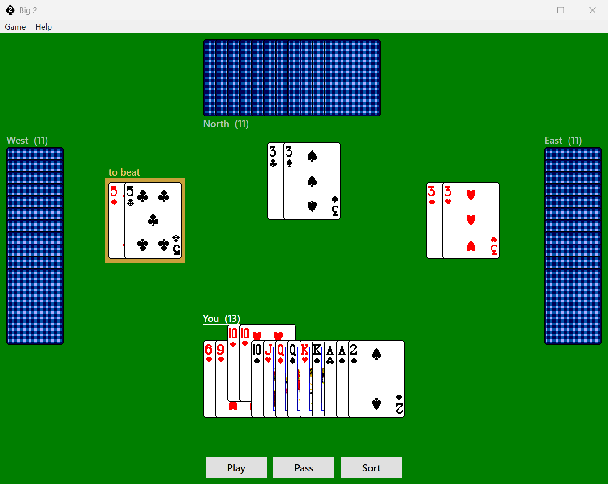

# Big2CS

Big 2 (also known as 鋤大弟, *Cho Dai Di*) is the Chinese climbing game where you race to empty your hand and the two of spades beats everything. 

This is a C# / WPF implementation of the game for Windows in .NET 10, in the
house style of the classic Windows-era card games, with three computer opponents.

> This is an original implementation. Big 2 is a traditional game with no author,
> and the rules here follow TEGL Systems Corporation's *Big2* v1.01 from 1990, recovered from its own documentation and from a log of 252 games it played.
> The card deck is original artwork, drawn pixel by pixel at 71x96 in the
> sixteen-colour VGA palette.



## What this is

- **Three computer opponents.** These players watch how close
  everyone is to going out, and stop being economical the moment someone is nearly there (the single thing that most separates a good Big 2
  player from a bad one). Every pass they make is for a stated reason, none of
  them passes at random to look thoughtful.
- **Three difficulty levels.** These differ by how much the opponents take in, not by how often they make random mistakes. An easy opponent only ever looks at its two cheapest plays and never notices someone about to go out. A hard one weighs
  every legal play and starts defending from five cards out. Each level's weights were tuned separately against the same reference, so an easy opponent is playing its own best game rather than a strong one with a hand tied. Computer players at each level beat the others by margins wide enough to measure. You can set the player difficulty in `Game ▸ Options`.
- **Tells you why a play is illegal.** Big 2's suit order is not
  the same as other games, and the ranking of its five-card plays can be difficult to remember. The game will tell you "the 5 of hearts does not beat the king of spades" so you learn why you can't make a certain move.
- **The series is open-ended.** You can play as many hands as you want or you can set a target score in `Game ▸ Options`.

## Getting started

Download **[Big2.exe from the latest release](https://github.com/jaredandersen/Big2CS/releases/latest)** — a single self-contained file, no installer and no runtime to install. Or build it yourself:

```
dotnet build Big2CS.slnx
dotnet run --project Big2.App/Big2.App.csproj
```

To produce a single self-contained executable in `dist/`:

```
pwsh -File tools/publish.ps1
```

## The rules

Very close to the common Big 2 rules (available at https://en.wikipedia.org/wiki/Big_two). But there are three differences worth noting:

- **Straights may wrap through the ace.** A-2-3-4-5 and 2-3-4-5-6 are both legal. A wraparound outranks a royal flush (since the two is the highest card in this game, it is also the highest card in a straight). J-Q-K-A-2 is **not** a straight.
- **Each hand after the first is led by the previous winner**, not by the player holding the three of diamonds every time.
- **Unplayed fours-of-a-kind and straight flushes carry no penalty.** Only cards, the ten-card threshold, and unplayed twos count against you.

The first hand is led by whoever holds the three of diamonds, and their opening
play must include it. After that, each hand is led by whoever won the last one.

At the end of a hand you keep one point for each card still in your hand, doubled
if you are holding ten or more, and doubled again for each two you never played.
**The lowest total wins**, so the score is a running tally of what you failed to
get rid of.


## Acknowledgements

No code was taken from any of these projects, but they did contribute design ideas and influenced my decisions:

- **[TEGL Systems' Big2 v1.01 from 1990](https://archive.org/details/BIG2_1020).** The game rules come from this version, and I tested against the log of 252 games it ships with, 229 of which can be replayed move for move. While this game is faithful to TEGL's rules, it's quite different from the program itself. It was a 1990 DOS game with its own look, opponents and scoring.

- **[maxjiang216/big2-ai](https://github.com/maxjiang216/big2-ai).** I learned how to tell
whether one computer player is actually better than another. Big 2 is a luck-heavy
game, so playing a thousand hands and comparing averages can't separate a real
improvement from lucky cards. The answer is to deal the same hands twice
with the players swapped between seats, so luck is cancelled out. 

- **[cappinmeow/big2-game](https://github.com/cappinmeow/big2-game).** I learned how my opponents could pick a move by scoring every option against a list of things that matter to them: how many cards it gets rid of, whether it breaks up a pair worth keeping, whether it wastes a two by playing it. Each of those options carries
a weight. cappinmeow's approach is to *find* those
weights by having the program play itself thousands of times and keeping whatever wins, instead of choosing them by hand. I replicated the approach to come up with my own weights rather than using the same numbers.

- **[Jennifer-Lion/big2-evaluator](https://github.com/Jennifer-Lion/big2-evaluator).**
I learned how to help the computer player judge whether a card in its hand is genuinely
powerful in that round (e.g. "is it a king?" vs. "is it the highest king that nobody has played yet?"). This makes the idea of *control* in a game something that can be calculated. 

- **The card deck.** Drawn for this project at native 71x96 and rendered at whatever size the game window is, with nearest-neighbour and no antialiasing, so it stays crisp at every scale.


## Project structure

```
Big2.Core/     Cards, rules, dealing, scoring, the AI, layout maths, hit testing.
               No WPF reference — which is what makes it testable.
Big2.App/      WPF: rendering, input, animation, dialogs, settings.
tools/         publish.ps1
```

Anything derivable from data lives in `Big2.Core`, including the table geometry and hit testing. 


## Licence

Two licences, because code and artwork are different kinds of work.

**Code — [Apache License 2.0](LICENSE).** Free to use, modify and redistribute,
including commercially and in closed-source products. No copyleft. It asks two
things in return: keep the notices, and reproduce the contents of
[NOTICE](NOTICE) wherever your own product shows notices of that kind — an
About box, a credits screen, a third-party licences page.

**Card artwork — [CC BY 4.0](LICENSE-ART.txt).** Everything under
`Big2.App/Assets/`. The deck was drawn for this project at native 71x96 in the
sixteen-colour VGA palette. Reuse it anywhere, commercially included, with
credit:

> Card deck by Jared Andersen, 2026 (CC BY 4.0)
> https://github.com/jaredandersen/Big2CS

No third-party artwork is embedded, and nothing here is derived from another
game's assets.